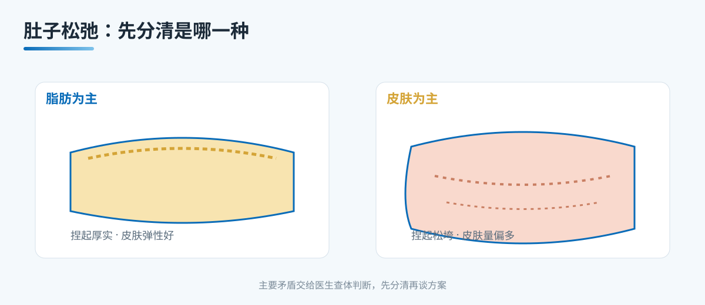

# A1 肚子松弛是"胖"还是"皮松"：先分清脂肪和皮肤

> 本文档为腹壁整形系列 A 档大众科普长稿，格式参照 microtia 站。
> 依据公开权威标准（ASPS 腹壁整形、ISAPS），发布前由专科医生审校。

## 三个备选标题

1. 肚子松弛是"胖"还是"皮松"：先分清脂肪和皮肤
2. 肚子一松一垂，到底是脂肪多还是皮肤多
3. 产后、减重后肚子松：先判断皮肤量再谈方案

本稿选用第 1 个作为工作标题。

## 封面介绍（100 字以内）

肚子松弛可能来自皮下脂肪堆积，也可能来自皮肤本身过度松弛。两者的处理路径不同：脂肪为主适合吸脂，皮肤量不足适合腹壁成形。先分清，再谈方案。

## 正文

先说结论：**"肚子松"不是一个诊断，它至少包含"皮下脂肪多"和"皮肤过度松弛"两种截然不同的情况。**两者的处理方式差别很大，用什么方法，取决于主要问题是脂肪还是皮肤。

很多患者把肚子松弛笼统理解成"胖了，减肥就能好"。这种想法不完全对。体重下降确实会让皮下脂肪减少，但如果皮肤弹性不足、已经被撑开太多，体重降下来之后皮肤仍然松弛下垂。这一段是腹壁整形和单纯吸脂最核心的分界。

### 用三件事区分脂肪和皮肤

下面三件事帮助判断主要矛盾，但最终仍需专科查体确认。

- 捏起厚度。
  用拇指和食指捏起腹部皮肤与皮下脂肪，判断捏起的厚度和质地。捏起后皮肤松垮、拉伸手感弱，提示皮肤弹性差、皮肤量相对偏多；捏起厚实、紧致，提示皮下脂肪偏多。
- 站立与平躺的差别。
  站立时腹部下垂明显、皮肤松弛有皱褶，平躺后皮肤仍然松弛、不能回缩，提示皮肤因素占主导。平躺后腹部相对平坦、松弛减轻，主要问题更可能在脂肪。
- 皮肤纹路与瘢痕。
  明显的妊娠纹、肥胖纹、长期皮肤牵拉后的纹路，提示皮肤已被撑开过。腹部既往手术瘢痕也会影响皮肤量与血供，是评估重点。

把这三件事放在一起，能对"脂肪为主"还是"皮肤为主"有个初步印象，但最终由医生查体判断。

### 单纯脂肪为主，适合什么

如果主要问题是皮下脂肪，且皮肤弹性尚可、量相对充足，那么以脂肪为对象的手段可能适合：

- 吸脂术。通过负压或能量设备去除局部皮下脂肪，改善轮廓。
- 单纯脂肪抽吸的边界。吸脂主要针对脂肪，不解决皮肤松弛。如果皮肤已经明显松弛，只吸脂可能让皮肤更松、皱褶更明显。

所以"脂肪为主"时，医生会先评估皮肤弹性与皮肤量，再决定是否适合单纯吸脂，或需要联合腹壁成形。

### 皮肤为主，适合什么

如果主要问题是皮肤过度松弛、皮肤量不足，腹壁成形（abdominoplasty）是更常被考虑的术式：

- 切除多余皮肤与皮下组织。
- 收紧腹直肌与腹壁筋膜（改善产后腹直肌分离、腹壁膨隆）。
- 重新定位肚脐（脐移位）。
- 改善腹壁轮廓与紧致度。

腹壁成形通常涉及一个较长的下腹切口，术后瘢痕是评估重点。它解决的正是"皮肤为主"的问题，但代价是瘢痕与较长的恢复期。

### 很多时候是混合型的

临床中多数是脂肪与皮肤问题并存，只是比例不同。此时可能出现几种组合：

- 脂肪为主、皮肤量相对充足。以吸脂为主，必要时联合少量切除。
- 皮肤为主、脂肪不多。以腹壁成形为主。
- 脂肪与皮肤都明显。可能联合吸脂与腹壁成形（详见 A10）。

具体怎么组合，由医生按你的皮肤量、脂肪量、腹直肌状态、瘢痕耐受度综合判断。患者不需要替医生决定术式，但需要理解"这个方案主要解决哪个问题"。

### 为什么要先分清，不要急着上网选术式

网上常见"吸脂就能瘦肚子""腹壁整形一次性解决"这类说法。医学上：

- 吸脂不解决皮肤松弛，把它当作腹壁整形的替代可能让你术后更失望。
- 腹壁成形解决的是皮肤与腹壁松弛，但伴随明显瘢痕与恢复期，不能轻率决定。
- 两者思路不同，选错方向是术后不满意最常见的原因之一。

因此第一次就诊的目标，不是立刻定术式，而是查体后判断主要矛盾在脂肪还是皮肤。

### 可能是手术之外的几件事

在谈手术之前，医生会先排除和讨论一些非手术因素：

- 体重是否稳定。若近期体重波动大，建议先稳定体重再评估。
- 妊娠计划。育龄期女性若还有生育计划，腹壁整形的时机需要讨论，因为再次妊娠可能让效果回退。
- 腹壁疝或腹直肌分离。若有明显的腹壁膨隆、可疑疝，需专科鉴别，不能简单当作"松"。
- 腹部既往手术史。剖宫产、胆囊手术、腹部肿瘤手术等，会影响皮肤血供与术式选择。

这些是非手术层面要先确认的，做到位了再谈整形方案。

### 边界与不承诺

需要把不会承诺什么讲清楚：

- 不承诺"无痕、零风险、一次永久、腹部完全平整"。
- 不承诺"吸脂能解决皮肤松弛"。
- 不承诺"腹壁成形后不再变化"，体重波动、妊娠、年龄都会影响长期效果。
- 不替患者选术式，也不在未查体前比较吸脂与腹壁成形。

### 就诊清单与可问医生的问题

- 我的主要问题是脂肪还是皮肤，判断依据是什么。
- 皮肤量与脂肪量分别如何，腹直肌有没有分离。
- 是否需要先做腹部超声或影像排除疝和腹壁结构问题。
- 如果要手术，属于哪种术式，切口在哪里、瘢痕预期如何。
- 恢复期多久，期间生活、工作、运动怎么安排。
- 本机构是否具备腹壁成形、吸脂、麻醉评估、术后随访的完整能力。
- 多重妊娠或生育计划对手术时机的影响。

## 收尾

肚子松弛先分清是"脂肪多"还是"皮肤松"，这是决定方案的第一步。脂肪为主和皮肤为主的处理路径差别很大，患者先理解这个分界，再和医生讨论术式，比直接上网搜"吸脂还是腹壁成形"更稳。把主要矛盾交给医生查体判断，把边界与风险问清楚，是这一步最有价值的事。

> 本文用于健康教育，不能替代整形外科/普外专科查体与麻醉评估。

## 参考资料

- American Society of Plastic Surgeons. Tummy Tuck (Abdominoplasty). https://www.plasticsurgery.org/cosmetic-procedures/tummy-tuck
- International Society of Aesthetic Plastic Surgery (ISAPS). Abdominoplasty. https://www.isaps.org/
- 中华医学会整形外科分会. 腹壁整形诊疗共识（公开版检索）

## 版本说明

- 大纲依据：《腹壁整形系列大纲.md》
- 本稿版本：v1（待医生医学审校、家长/患者可读性测试）
- 待办：医生署名、专科审校、机构能力边界自检
