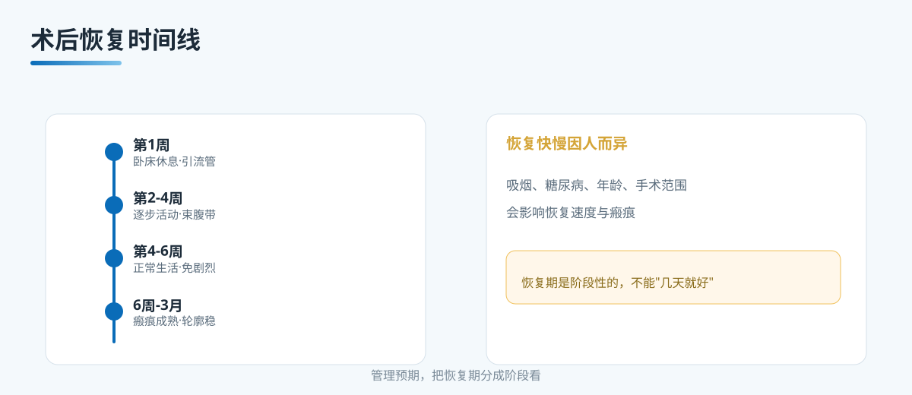

# A11 腹壁整形不是一次就结束：恢复时间线

> 本文档为腹壁整形系列 A 档大众科普长稿，格式参照 microtia 站。
> 依据公开权威标准（ASPS 腹壁整形术后恢复、ISAPS、国内整形外科教材），发布前由专科医生审校。

## 三个备选标题

1. 腹壁整形不是一次就结束：恢复时间线
2. 术后恢复要多久，按这几个阶段走不会乱
3. 别用"几天就好"计划你的腹壁整形恢复

本稿选用第 1 个作为工作标题。

## 封面介绍（100 字以内）

腹壁整形的恢复是一个分阶段的漫长过程，不是"几天就恢复好"能概括的。把它分成早期、中期、中后期和长期几个阶段，按阶段管理预期、活动和随访，是恢复期最稳的方式。

## 正文

先说结论：**腹壁整形的恢复期不是一条直线，而是分阶段的。**术后第一周、第 2-4 周、第 4-6 周、6 周到 3 个月、以及之后几个月，身体在每个阶段做的事情不一样，能承受的活动也不一样。用"几天就好"来套所有人，既不符合实际，也容易让恢复期走弯路。把恢复期分开看，按阶段管理预期，是腹壁整形术后最重要的一件事。

很多人对腹壁整形的恢复有一个共同误解，以为做完手术头几天难受，之后就开始变好、变平。实际上前面几周辛苦，中间有一个逐步恢复的爬坡，轮廓和瘢痕的成熟要花几个月时间。这篇文章把恢复期按时间分阶段讲清楚，帮您建立合理的预期。

### 先分诊：哪些人恢复会更慢，需要更早安排

在进入阶段之前，先做一次分诊。下面这些情况的人，恢复期通常会更长，或者某一阶段需要更精细的护理：

- 吸烟者。烟草直接影响皮肤血供和伤口愈合，会让愈合变慢、瘢痕更明显。术前戒烟是恢复期的重要前提。
- 血糖控制不佳的人。糖尿病会显著增加伤口愈合不良和感染风险，恢复期会被拉长，需要更早、更密的随访。
- 服用抗凝药物的人。手术前后需要按医嘱调整用药，出血和血肿风险更高，恢复期需要更细的观察。
- 腹部做过多次手术、瘢痕较多的人。皮肤血供和筋膜条件更复杂，愈合和轮廓稳定会需要更长时间。
- 手术范围较大、或联合吸脂的人。组织剥离更广，渗出更多，恢复期相应更长，引流管也可能带得更久。
- 年龄较大、营养状况一般、皮肤弹性较弱的人。愈合速度会慢一些。

分诊的意义在于，不同的人恢复节奏不一样。不要用网上别人"一两周就恢复好"的个例来套自己。

### 术后第 1 周：以卧床休息为主的阶段

这一周是整个恢复期里最辛苦、也最需要静养的阶段。

- 体位。术后头几天建议屈膝半卧位，也就是膝盖垫高、身体微微后仰，这样能减少腹壁皮肤的张力，让切口和皮瓣更放松。平躺伸直腿反而会让切口被拉紧。
- 活动。这一周以卧床和短距离室内走动为主。走动很重要，是为了帮助恢复肠道和防止血栓，但要慢慢来，不要勉强。
- 引流管。多数会在腹部留置引流管，排出伤口渗出的液体。具体拔除时间由医生判断。
- 疼痛。术后头几天疼痛比较明显，会有镇痛方案。疼痛会随时间下降，但如果疼痛反常地加重、难以缓解，要马上联系医生。
- 护理。需要家人帮助完成简单的起居，比如起床、上厕所、换敷料。心理上也要接受"这一周就是休息"这个事实。

这一周的核心是"好好休息、按时随访、观察引流与疼痛"，而不是急着站直、急着看轮廓。

### 第 2-4 周：逐步增加活动

进入第二周，身体开始从"修复"转向"适应"。

- 活动量。可以逐步增加，比如在室内走动、做轻微的家务、短时间坐着。有的医生会安排适度的行走来帮助恢复。
- 束腹带或压缩衣。这个阶段通常会建议按医嘱佩戴束腹带或压缩衣，提供支撑、减轻水肿、帮助轮廓贴合。
- 拆线。拆线时间视切口位置、愈合情况和医生安排，通常在术后 1-3 周左右。有的使用可吸收缝线，就不需要拆。具体按医嘱。
- 仍要避免。提重物、弯腰、剧烈活动和长时间站立。腹壁还处在愈合的脆弱期，这些动作会增加切口张力，甚至诱发血肿或裂开。
- 随访。这个阶段有一次或几次复查，医生会查看切口、引流管、皮瓣血运，决定下一步安排。

这一阶段的重点是"能做的慢慢做，不能做的仍先不做"。恢复不是比拼谁先回到正常生活，而是每一步都稳。

### 第 4-6 周：逐步恢复正常生活，仍避免剧烈运动

到了第四个星期，多数人可以恢复正常生活的大多数内容。

- 生活。可以恢复上班、开车、正常的日常走动，但要根据自己的体感调整。腹部肿胀和发紧感还比较明显，这是正常的。
- 活动。仍然要避免剧烈运动，比如跑步、跳跃、核心训练、搬运重物。这些运动对腹壁的牵拉太大，容易让恢复倒退或出现并发症。
- 姿势。站直会开始变得自然一些，但弯腰仍要慢慢来。
- 轮廓。这个阶段肿胀还没有完全消退，看到的样子不是最终的样子，不要因为暂时的不平整而焦虑。

### 6 周到 3 个月：瘢痕成熟、轮廓趋稳

从第六周开始，进入一个相对稳定的阶段。

- 瘢痕。切口瘢痕会经历一个从红、硬、凸，到逐渐成熟、变软、变淡的过程，这个过程要持续几个月。它会有个体差异，也会受到体质、护理、阳光照射的影响。
- 轮廓。腹部轮廓在这个阶段逐步趋向稳定，但肿胀影响还在，需到更长时间才能看到接近最终的形态。
- 运动。可以在医生允许后逐步恢复运动，从散步、游泳等温和运动开始，逐步增加强度。恢复运动要循序渐进，不要一次上强度。
- 门诊。这个阶段通常还有一次随访，评估瘢痕、轮廓和恢复情况。

### 长期：满意效果需数月，瘢痕持续软化

手术的真正"定型"需要更长时间。

- 效果稳定。腹壁整形后，轮廓和皮肤弹性的稳定通常需要几个月到更久。体重变化、妊娠、年龄都会影响长期的形态。
- 瘢痕。瘢痕成熟一般要 6 个月到 1 年甚至更久，会持续软化、颜色变浅。它与体质、切口位置、术后护理和日晒都有关系。
- 随访。之后按医生建议安排随访。遇到体重大幅变化、再妊娠、或腹部出现不适时，要重新评估。

### 恢复期里，哪些变化是正常的，哪些要当回事

恢复期会出现一些让人担心、但多数是正常的变化，比如切口周围的轻度红肿、皮肤发紧、暂时的不平整、瘢痕突起、轻微低热。这些多与愈合和水肿有关，会随时间改善。

但另一类变化要当回事，就是我们说的红旗信号。切口异常渗液渗血、发热寒战、皮瓣颜色发白发紫发黑、单侧腿部肿胀疼痛、呼吸异常，这些不是"正常恢复"，要马上联系医生。

判断的办法是看变化趋势。正常的不适是逐步减轻的，红旗信号是逐步加重或突然出现的。一旦拿不准，多问一次医生。

把恢复期分成这几个阶段，您就能理解为什么不能用"几天就好"来概括。恢复是按阶段推进的，每个阶段有自己的节奏和重点。

### 边界与不承诺

- 不承诺"无痕、零风险、一次永久、腹部完全平整"。
- 不承诺"几周就完全恢复好"。恢复时间因人而异，与手术范围、体质、护理和并发症都有关。
- 不承诺"恢复期不会遇到任何转折"。肿胀、发紧、瘢痕突起、暂时不平整，多数是过程的一部分，但如果出现红旗信号，要及时就医。
- 不把"腹壁整形=身材管理"当卖点。恢复的目标是让切口愈合、轮廓稳定，而不是用来计划身材管理。

### 就诊清单与可问医生的问题

到重庆西区医院医学美容中心就诊前，可以带上：

- 自己的年龄、体重史、吸烟与用药情况、既往腹部手术史。
- 糖尿病的近期复查记录（如适用）。

当面可以问医生：

- 我的恢复期大致会分几个阶段，每个阶段大概多久。
- 我属于"恢复较慢"的人群吗，需要提前注意哪些。
- 引流管什么时候拔、束腹带要戴多久、拆线安排在什么时候。
- 第几周可以恢复上班、开车、运动，什么运动能做、什么还不能。
- 我该观察哪些信号，出现什么情况要马上联系医生。
- 本机构是否具备术后随访、瘢痕管理、并发症处理的完整能力。

## 收尾

腹壁整形不是"做完就结束"。它有一个分阶段的恢复过程，从卧床休息，到逐步活动，再到恢复正常生活、瘢痕成熟和轮廓稳定，每一步都有自己的节奏。把恢复期分开看，按阶段管理预期，才能既保护切口愈合，又对最终形态有合理的期待。不要用"几天就好"或网上别人的个例来套自己，您的恢复节奏由医生和您的身体共同决定。

> 本文用于健康教育，不能替代整形外科/普外专科查体与麻醉评估。

## 参考资料

- American Society of Plastic Surgeons. Tummy Tuck (Abdominoplasty) - Recovery. https://www.plasticsurgery.org/cosmetic-procedures/tummy-tuck
- International Society of Aesthetic Plastic Surgery (ISAPS). Abdominoplasty. https://www.isaps.org/
- 中华医学会整形外科分会. 腹壁整形诊疗共识（公开版检索）

## 版本说明

- 大纲依据：《腹壁整形系列大纲.md》
- 本稿版本：v1（待专科医生审校）
- 待办：医生署名、专科审校、机构能力边界自检
