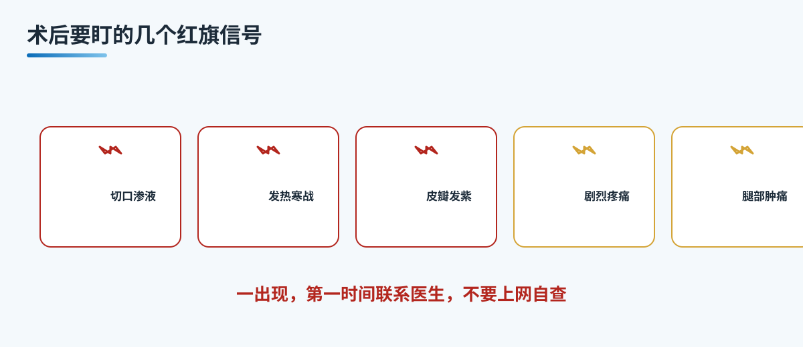

# A13 术后红旗警报：这些信号要马上联系医生

> 本文档为腹壁整形系列 A 档大众科普长稿，格式参照 microtia 站。
> 依据公开权威标准（ASPS 腹壁整形并发症与风险、ISAPS、CDC 静脉血栓栓塞、国内整形外科教材），发布前由专科医生审校。

## 三个备选标题

1. 术后红旗警报：这些信号要马上联系医生
2. 腹壁整形术后要盯的几件事，别等下一次随访
3. 出现这些情况不要上网自查，先联系医生

本稿选用第 1 个作为工作标题。

## 封面介绍（100 字以内）

腹壁整形术后，有些信号一出现就要马上联系医生：切口异常渗液渗血、发热寒战、切口红肿扩散、皮瓣发白发紫发黑、剧烈疼痛不缓解、单侧腿部肿胀疼痛、呼吸异常。识别红旗、及时处理，比什么都重要。

## 正文

先说结论：**腹壁整形术后，有几种信号一出现就不能等。**有些信号提示感染、血肿、皮瓣血运障碍、深静脉血栓或肺栓塞，拖延处理可能带来严重后果。本文的目的不是吓唬人，而是把需要马上联系医生的"红旗"讲清楚，让您能识别、能判断、能及时处理。对红旗，正确的做法是联系医生，而不是上网自查。

### 先分诊：为什么红旗要单独拎出来讲

绝大多数腹壁整形术后恢复是顺利的，前面讲的分阶段恢复和术后护理，是大多数人走的路。但正因为多数顺利，才容易被少数不顺利的信号蒙住。红旗信号的意义，在于帮您区分"恢复中的正常不适"和"需要处理的问题"。

判断的优先级是这样的：先排除危险信号，再谈恢复和轮廓。如果出现下面任何一种红旗，请不要把它当"正常反应"、不要等下一次随访、也不要只靠网上经验判断，要第一时间联系医生。

### 立即联系医生的红旗信号

**切口异常渗液或渗血。**术后少量渗出是正常的，但如果渗出量明显增多、持续渗血、渗出液颜色异常或流出物有异味，需要告诉医生。切口持续渗血可能提示血肿，渗出异常可能提示感染或积液。

**引流管异常高引流量。**术后头一两天引流量较多是正常的，但如果引流量突然显著增多、引流管流出血液、或引流瓶在很短时间内被测满，要立即告知医生。这可能提示血肿或渗出过多。

**发热或寒战。**术后低热或一过性低热可能正常，但持续发热、高热、或发热伴随寒战，可能提示感染。要测体温、记录，并及时联系医生。

**切口红肿扩散。**术后切口周围有一点红肿可以理解，但如果红肿范围扩大、持续加重、皮温升高、或伴随发热，可能提示伤口感染，不要等它自己好。

**皮瓣颜色发白、发紫或发黑。**这是提示皮瓣血运障碍的重要信号。正常愈合的皮瓣应是接近皮肤的颜色、质地柔软。如果某处皮瓣颜色变白、变紫、变暗或发黑，质地变硬、起水疱或出现坏死样表现，是紧急情况，要立即联系医生。皮瓣血运障碍处理越早，越有可能保住组织。

**剧烈疼痛不缓解。**术后疼痛会随时间逐步下降，如果出现疼痛加重、或某个部位剧烈疼痛且镇痛后不缓解，可能提示血肿、感染或筋膜张力异常，要联系医生。

**单侧腿部肿胀或疼痛。**这是提示下肢深静脉血栓的重要信号。如果一侧小腿或大腿出现肿胀、疼痛、发红、皮温升高，或行走时疼痛，要警惕血栓。血栓一旦脱落可能引起肺栓塞，属于紧急情况。这里要注意，不要自行按摩肿胀的腿，应尽快联系医生评估。

**呼吸异常。**呼吸困难、胸闷、气促、胸痛、咳嗽或咳血，可能提示肺栓塞或肺部问题，是紧急情况，要立即就医。这比伤口本身更需要优先处理。

**束腹带过紧导致皮肤受压。**束腹带或压缩衣过紧，会造成皮肤受压、颜色改变、麻木或疼痛。如果发现被束腹带勒出的部位皮肤发白、发紫、麻木、疼痛或出现水疱，要立即调整压力或取下，并告诉医生，避免皮肤受压损伤。

上面这些信号里，皮瓣发白发紫发黑、单侧腿部肿胀疼痛、呼吸异常、高热寒战，这几项紧急程度更高，一旦出现不要犹豫，尽快联系医生或就近就医。

### 出现红旗信号，第一时间该怎么做

- 停下来。停止当下所有活动和自我护理的"补救"尝试。
- 联系。第一时间联系重庆西区医院医学美容中心或您的接诊医生。如果无法联系或情况紧急，就近到医院急诊。
- 告知。向医生清楚说明哪一项信号、什么时候开始、程度如何，方便医生判断和处理。
- 不要自我处理。不要自行热敷、冷敷、挤压、挑破、放血，也不要按网上的说法处理。有些处理会加重血肿或感染。
- 保留记录。把体温、渗液情况、颜色变化、疼痛变化简单记下来，就诊时能给医生参考。

### 哪些情况通常不算红旗，但也别大意

为了避免"草木皆兵"和"掉以轻心"两头，把几类常见但通常不需要紧急处理的情况也说明白。

- 术后早期的肿胀、皮肤发紧。多与水肿和组织适应有关，会随时间逐步减轻。
- 切口周围的轻度红肿、轻微渗液。手术后早期可以理解，只要不持续扩大、不增多、不加重。
- 一过性低热。术后一小段时间内可能发热，但如果是持续高热或伴寒战，就要按红旗处理。
- 瘢痕早期发红、发硬、轻微突起。这是瘢痕愈合的正常阶段，不是感染。

判断的办法仍是看趋势。正常反应是逐步减轻的，红旗信号是逐步加重或突然出现的。这两类有时候在早期不好完全区分，宁可多问一次，也不要硬扛。给医生描述时，把"什么时候开始的、怎么变化的、现在到了什么程度"说清楚，医生更容易判断。

### 边界与不承诺

- 不承诺"无痕、零风险、一次永久、腹部完全平整"。
- 不承诺"术后一定不会出现并发症"。并发症发生风险存在，重点是识别和处理，而不是保证不发生。
- 不承诺"网上自查能代替就医"。信息只能帮助识别，不能代替医生的判断和处理。
- 不把"腹壁整形=身材管理"当卖点。本文讲的都是健康与安全，与身材管理无关。

### 就诊清单与可问医生的问题

术后随访时，到重庆西区医院医学美容中心可以带上：

- 自己的体温记录、用药清单。
- 引流管引流瓶液体的情况记录（如果还在带管）。
- 术后切口及皮瓣的观察记录，包括颜色、渗液、肿痛变化。

当面可以问医生：

- 我该重点观察哪几项信号，出现什么要马上联系。
- 引流瓶里的液体，我该怎么记录和衡量。
- 束腹带多紧合适，会不会过紧，过紧有什么表现。
- 哪些不适是正常恢复，哪些要当回事。
- 深夜或周末如果出现信号，该怎么联系、到哪里就医。
- 本机构是否具备术后 24 小时可联系、并发症处理的完整能力。

## 收尾

腹壁整形术后，绝大多数人恢复顺利，但少数信号一旦出现就不能等。切口异常渗液渗血、引流管异常高引流量、发热寒战、切口红肿扩散、皮瓣发白发紫发黑、剧烈疼痛不缓解、单侧腿肿腿痛、呼吸异常、束腹带过紧致皮肤受压，这些都属于需要及时处理的红旗。识别红旗、第一时间联系医生，比任何"恢复快"的期待都更重要。对红旗，联系医生，而不是上网自查。

> 本文用于健康教育，不能替代整形外科/普外专科查体与麻醉评估。

## 参考资料

- American Society of Plastic Surgeons. Tummy Tuck (Abdominoplasty) - Risks & Complications. https://www.plasticsurgery.org/cosmetic-procedures/tummy-tuck
- International Society of Aesthetic Plastic Surgery (ISAPS). Abdominoplasty. https://www.isaps.org/
- Centers for Disease Control and Prevention. Venous Thromboembolism (Blood Clots) - Signs and Symptoms. https://www.cdc.gov/
- 中华医学会整形外科分会. 腹壁整形诊疗共识（公开版检索）

## 版本说明

- 大纲依据：《腹壁整形系列大纲.md》
- 本稿版本：v1（待专科医生审校）
- 待办：医生署名、专科审校、机构能力边界自检
