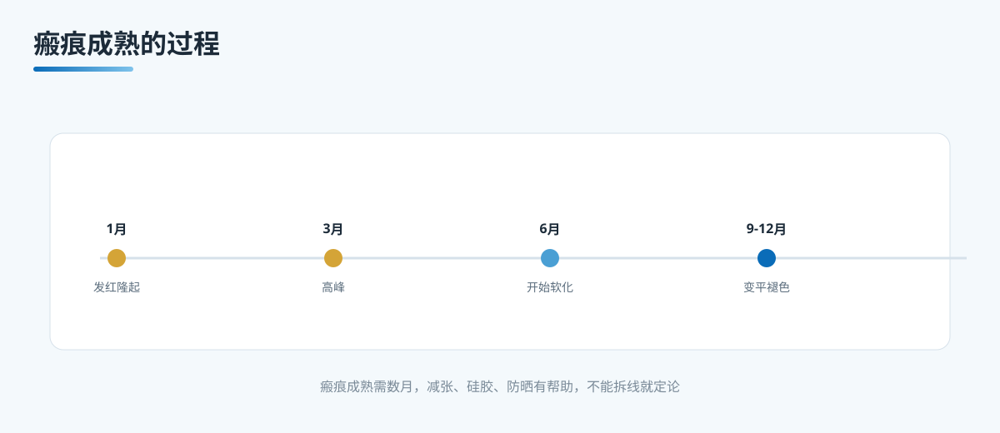

# A14 瘢痕能变成什么样：先懂预期，再谈管理

> 本文档为腹壁整形系列 A 档大众科普长稿，格式参照 microtia 站。
> 依据公开权威标准（ASPS 腹壁整形瘢痕管理、ISAPS、国内整形外科教材），发布前由专科医生审校。

## 三个备选标题

1. 瘢痕能变成什么样：先懂预期，再谈管理
2. 腹壁整形的疤：前几个月会怎样，怎么护理
3. 拆线不等于定论：瘢痕的成熟、管理与个体差异

本稿选用第 1 个作为工作标题。

## 封面介绍（100 字以内）

腹壁整形会留下一道下腹切口瘢痕。它的成熟需要数月，前面几个月会发红、隆起、发痒，之后逐渐软化、褪色、变平。张力、防晒、护理和个人的瘢痕倾向，都会影响最终模样。

## 正文

先说结论：**腹壁整形的切口会留下一道瘢痕，它并不会立刻停在一个固定的样子上。**这道瘢痕通常位于下腹部，位置和剖宫产切口相近，但往往更长。前面几个月它会发红、隆起、发痒，这是很多切口都要经历的正常成熟阶段，之后随着时间逐渐软化、褪色、变平。它什么时候稳定下来、最终变成什么样，会受到张力、日照、感染、护理，以及个人瘢痕倾向等多种因素的影响。所以拆线那天就断定"以后好不好看"，为时尚早。

很多患者最关心"疤痕能不能消失"。这里要先把一个常见的期待纠正过来：**瘢痕不会完全消失，只会逐渐减弱。**科学管理能让它变得更平、更淡、更接近周围皮肤，但任何手术切口都会留下某种程度的印记。理解这一点，是把期待放到正确起点上的第一步。

### 先分清这件关键事：是正常成熟，还是需要警惕的信号

谈瘢痕护理之前，先做一次分诊。前面几个月瘢痕发红、隆起、发痒，多数是正常成熟过程，不必过度担心。但有些表现需要先处理，不能只当作"在长疤"。下面这些属于应该尽快让医生看的信号：

- 切口持续渗液、渗血，或突然红肿加重。
- 切口周围发热、跳痛，或出现脓性分泌物。
- 瘢痕隆起得特别快、特别明显，超过一般程度。
- 切口有裂开的迹象，皮肤边缘对合不良。
- 伴随发热、全身不适，需要警惕感染。

出现这些情况，先排除感染、血肿、皮瓣坏死、伤口裂开这类并发症，再谈外观层面的瘢痕管理。换句话说，**安全的底线永远是先排除危险信号，再关心疤痕美不美观。**这一步顺序不能颠倒。

### 瘢痕的成熟要多久，前面几个月会怎样

把危险的信号放在一边，多数人的瘢痕会走这样一条大致的时间线：

- 术后 2-4 周。切口刚愈合，瘢痕偏红、偏硬，可能有轻微隆起，这是早期炎症与增生阶段的表现，多数属于正常。
- 术后 1-3 个月。瘢痕发红、发痒可能加重，有时变得更明显隆起、更硬。很多患者在这个阶段最焦虑，但它往往正是增生较明显的窗口期。
- 术后 3-6 个月。瘢痕开始逐渐软化、褪色，发红和隆起逐步减轻，质地变得不那么坚硬。
- 术后 6 个月到 1 年。瘢痕继续向更稳定、更接近周围皮肤颜色的方向变化，多数在 1 年左右趋于稳定。达到完全成熟的稳定状态，有的个体需要更长时间，甚至到 1 年半到 2 年。

这条时间线只是多数人的大致走向，不是每个人都会完全一致。**同一个人的不同部位、不同个体之间，瘢痕的变化速度差别可能很明显。**所以不要拿自己的进度去和别人对比，也不要因为某个月看起来"没变化"就急着下结论。

### 瘢痕管理：这几件事现在就能做起来

下面几件事是现行公认、对多数人有效的瘢痕管理手段，属于在医生指导下可以做起来的部分。它们的目标是让瘢痕变得更平、更淡、更接近正常皮肤，而不是让它消失。

- 减张。张力是决定腹壁瘢痕走向的重要因素。下腹部受站立、弯腰、转身、腹部活动牵拉较大，张力越集中，瘢痕越容易变宽、隆起。医生可能建议使用减张贴、减张胶布，或在术后一段时间内借助束腹带减少腹部牵拉。减张的核心是让切口在张力较小的状态下愈合，这一步对下腹部的长切口尤其重要。
- 硅胶贴或硅胶凝胶。硅胶类产品是瘢痕护理里较为常用的一类，通常建议在切口完全愈合、不再有渗液后开始使用，按产品说明和医生建议坚持一段时间。硅胶能改善瘢痕的平整度与颜色，但需要规范使用，不能拆线当天就急着贴上。
- 防晒。紫外线会让瘢痕更容易出现色素沉着，变得比周围皮肤更深。术后一段时间内，瘢痕部位要注意紫外线防护，可以用衣物遮挡、物理防晒或温和的防晒产品。防晒这件事要持续到瘢痕稳定，而不只是前面几周。
- 避免过度牵拉。避免去用力拉伸、抓挠、用指甲抠，也不要做会直接牵拉切口的大动作，尤其是在瘢痕还比较敏感的时期。过度的物理刺激可能让瘢痕更红、更痒、更硬。
- 按医嘱。具体用哪种减张产品、硅胶用多久、什么时候开始、要不要配合其他护理，都应由医生按你的切口情况、皮肤状态和瘢痕倾向来定。不要把他人的经验照搬到自己身上。

这些手段不是"做了就一定能完全平整"，而是"做了能让它往更好的方向走"。它们的作用是降低不利因素，不是消灭瘢痕。

### 哪些因素会影响最终瘢痕

同样是腹壁整形，不同人的瘢痕差别可能很大。下面几件事是医生评估时会考虑的：

- 个人瘢痕倾向。皮肤容易增生、容易形成瘢痕疙瘩的人，术后瘢痕更可能明显。既往伤口是否容易留明显疤，是判断的重要参考。
- 切口张力。张力越大，瘢痕越可能变宽、隆起，因此减张的重要性前面已经强调。
- 是否发生感染或伤口问题。一旦出现感染、血肿、皮瓣坏死、伤口裂开，瘢痕往往更难控制，所以在术后窗口期预防和及时处理并发症，本身就是瘢痕管理的一部分。
- 皮肤类型与肤色。不同肤色对日照的反应不同，色素沉着的程度也有差别。
- 术后护理是否到位。是否坚持减张、防晒、硅胶使用，是否避免过度牵拉，都会影响进度与最终状态。

这些因素中，有些是个人固有的，有些是可以控制的。理解哪些可控、哪些不可控，能让期望更贴近现实。

### 边界与不承诺

关于瘢痕，需要把不会承诺什么讲清楚：

- 不承诺"无痕"。任何手术切口都会留下印记，瘢痕只会逐渐减弱，不会消失。
- 不承诺"完全平整、和周围皮肤一模一样"。硅胶、减张、防晒能改善，但不保证达到零痕迹。
- 不承诺"一次就永远定型"。瘢痕在数月到一两年内仍会变化，稳定之后也不代表不会再受后续因素影响。
- 不承诺"只有美容问题"。瘢痕异常隆起、伴发痒痛，有时背后是瘢痕疙瘩或增生性问题，需要专科评估，不能只按"美观"对待。
- 不替患者打包票。最终瘢痕受体质、张力、感染、护理共同影响，医生无法提前给出绝对承诺。

### 就诊清单与可问医生的问题

到重庆西区医院医学美容中心就诊，关于瘢痕可以当面问：

- 我的切口张力如何，需不需要减张产品，用多久。
- 硅胶贴和硅胶凝胶哪一种更适合我，什么时候开始用。
- 术后多久可以开始防晒，物理防晒还是防晒霜。
- 恢复到什么时候可以不需特殊护理，什么时候需要复诊。
- 我既往伤口容易留疤吗，属于容易增生的体质吗。
- 需要警惕哪些信号，出现时应如何处理。
- 瘢痕如果在增生期，有哪些可用的干预手段，各自利弊如何。

把上面这些问题带着，能让你在门诊把"这个疤会怎样、我能做什么"一次问清楚，而不是回家对着镜子焦虑。

## 收尾

腹壁整形会留下一道下腹切口瘢痕，它不会立刻定型，也不会完全消失。前面几个月发红、隆起、发痒，多数是正常成熟过程，之后逐渐软化、褪色、变平。过程中先分清正常成熟和需要警惕的信号，再谈减张、硅胶、防晒这些护理手段。最终瘢痕受体质、张力、感染、护理共同影响，没有人能提前打包票。把预期放到"逐渐减弱"而不是"完全消失"上，用规范护理把不利因素降到最低，比急着判断到底好不好看，更有意义。

> 本文用于健康教育，不能替代整形外科/普外专科查体与麻醉评估。

## 参考资料

- American Society of Plastic Surgeons. Tummy Tuck (Abdominoplasty). https://www.plasticsurgery.org/cosmetic-procedures/tummy-tuck
- American Society of Plastic Surgeons. Scar Management / Scar Revision. https://www.plasticsurgery.org/cosmetic-procedures/scar-revision
- International Society of Aesthetic Plastic Surgery (ISAPS). Abdominoplasty. https://www.isaps.org/
- 中华医学会整形外科分会. 腹部整形与瘢痕防治诊疗共识（公开版检索）

## 版本说明

- 大纲依据：《腹壁整形系列大纲.md》
- 本稿版本：v1（待专科医生审校）
- 待办：医生署名、专科审校、机构能力边界自检
