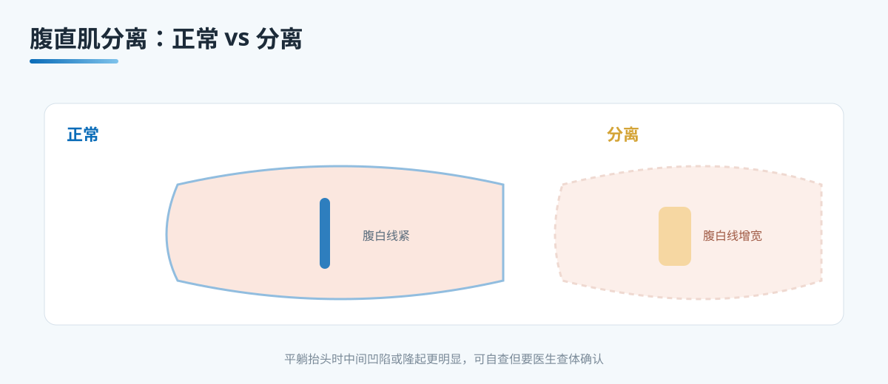

# A3 产后肚皮回不去：腹直肌分离要不要手术

> 本文档为腹壁整形系列 A 档大众科普长稿，格式参照 microtia 站。
> 依据公开权威标准（ASPS 腹壁整形、ISAPS），发布前由专科医生审校。
> 发布机构：重庆西区医院医学美容中心。

## 三个备选标题

1. 产后肚皮回不去：腹直肌分离要不要手术
2. 肚子中间鼓起一条沟，是腹直肌分离还是脂肪
3. 产后腹直肌分离：先练核心，再谈手术

本稿选用第 1 个作为工作标题，因为它同时点出产后最常被问的那个判断，也把"要不要手术"这个核心问题放到标题里。

## 封面介绍（100 字以内）

产后肚子松软、中间鼓起一条纵向的沟，可能是腹直肌分离，也可能只是脂肪堆积或皮肤松弛。两者的处理路径不同。多数产后腹直肌分离可先通过核心康复改善，是否手术要看分离程度、症状与生育计划。

## 正文

先说结论：**产后"肚子回不去"并不是一个诊断，腹直肌分离只是其中的一种情况。**肚子中间鼓起一条纵向的沟、平躺时抬头或咳嗽时更明显，是腹直肌分离的典型表现。但也有不少产妇的肚子松主要来自脂肪堆积和皮肤松弛。三种情况可以并存，处理路径却不同，必须先分清主次。

很多产妇在产后第一年反复问"怎么肚子还是这么大""还能不能再回去"。这些担心可以理解，但把问题先归到正确的类别里，再谈对策，比急着决定要不要做手术更稳。

### 什么是腹直肌分离

腹直肌是腹部中线两侧方向的两条肌肉，中间以腹白线相连。怀孕期间，随着子宫增大和激素变化，腹白线逐渐被撑开，两侧腹直肌向左右分离，为胎儿提供空间。产后这个分离可能不能完全复位，就形成了腹直肌分离。

它常见的表现有：

- 腹部中间出现一条纵向的凹陷或隆起，平躺抬头、咳嗽、用力时更明显。
- 肚脐上方或下方可触及两侧肌肉的边缘，中间像一条较宽的沟。
- 腹壁整体松弛、膨隆，核心肌群力量减弱。
- 部分产妇伴随腰背痛、盆底功能下降或腹壁无力感。

分离的宽度与腹壁张力，医生一般通过专科查体判断，必要时用腹部超声测量。临床上常把约 2 厘米当作一个参考界值，但"要不要处理"从来不只看这一个数字，还要看症状、功能与生活影响。

### 先分清腹直肌分离、脂肪堆积和皮肤松弛

下面三组线索帮助判断主要矛盾，最终仍需专科查体确认。

- 平躺抬头或咳嗽时的变化。
  腹直肌分离的人，平躺抬头或用力时中间凹陷或隆起更明显，能摸到肌肉边缘。脂肪堆积的人，平躺后腹部相对平坦，抬头变化不如分离明显。
- 摸起来的手感与位置。
  腹直肌分离主要在腹部中线区域，触感偏松软、中间像一条沟。脂肪堆积多分布在皮下，摸起来厚实、均匀，位置不局限于中线。
- 站立与坐姿的体态。
  脂肪堆积时腹部向前突出，坐姿或站立时饱满。皮肤松弛时腹部皮肤松垮、下垂、有皱褶，与分离常同时存在。

临床上多数产妇是三者的混合体，只是比例不同。先说清楚这个"混合"，是因为它直接决定了先做康复、还是直接评估手术。

### 产后恢复期分了哪几步

产后腹壁的状态会随时间变化，所以"时机"很重要。

- 产后 0 到 6 周。
  以缓解疲劳、轻柔活动和呼吸训练为主，避免过早做剧烈增加腹压的动作。这一阶段更适合评估与观察，不适合谈手术。
- 产后 6 到 12 周。
  逐步建立核心与盆底康复，练习深层核心激活，在指导下循序渐进。
- 产后 3 到 6 个月。
  多数产妇能感到核心力量与腹壁张力改善，可在此阶段复查分离程度与症状。
- 产后 1 年及更久。
  若康复后分离仍明显、症状持续、对生活影响较大，再与医生讨论手术。

这条时间线说明，产后一开始并不着急做手术。把康复窗口用足，再评估残留问题，是更合理的顺序。

### 先做核心康复，这是第一步

对大多数人来说，先做核心康复是比直接手术更稳妥的第一步。核心康复的目标是把深层腹壁肌群和盆底肌重新激活、协同工作。

- 腹式呼吸与膈肌呼吸，作为康复的起点。
- 深层核心激活，重点在腹横肌与盆底肌的协同收缩。
- 循序渐进，避免仰卧起坐、卷腹等显著增加腹压或过度分离的动作。
- 在康复师、物理治疗师或产康专业人员指导下进行，动作到位、量力而行。

并不是所有人都适合立刻自行康复。如果出现腹部疼痛、可疑疝、产后出血或感染、盆底功能明显异常等，应先就医，排除问题后再进行康复。

### 手术收紧适合谁

如果康复已经做到位，分离程度仍然明显、症状持续、明显影响生活与功能，医生才会讨论腹壁成形术（abdominoplasty），这类手术通常包含腹直肌折叠。

- 切除腹部多余皮肤与皮下组织。
- 收紧腹直肌与腹壁筋膜，把分离的腹直肌向中线靠拢（腹直肌折叠）。
- 重新定位肚脐，必要时做脐移位。
- 改善腹壁轮廓与紧致度。

它解决的是"结构松弛"这一层，但代价是较长的下腹切口、明显的瘢痕与较长的恢复期。适合的人，一般是已完成生育或不再计划妊娠、核心康复后仍有明显残留、且能理性接受瘢痕与恢复期的人。

### 为什么先做康复，再评估手术

把手术放在康复之后，是出于几个实际考虑：

- 多数轻中度分离可以通过核心康复得到改善，避免一次不必要的手术。
- 康复能帮助判断真正残留的分离与症状，让评估更有依据。
- 让腹壁肌肉与筋膜恢复到更稳定的状态，术后恢复更可预期。
- 避免在身体状态尚未稳定时过早手术，减少不必要的风险与创伤。

这不是说"康复一定能让所有分离都消失"，而是强调"先把能改善的部分改善了，再决定剩下的是否需要手术"。把顺序反过来，容易在身体还没恢复时做出过早的决定。

### 再次妊娠对效果的影响

这一点非常重要，也是最常被忽略的。

- 妊娠会再次撑开腹壁与腹白线，已经完成腹壁成形与腹直肌折叠的效果可能明显回退。
- 因此一般建议在完成全部生育计划、或确定不再妊娠之后，再考虑腹壁成形。
- 如果还有再次妊娠的计划，应该先与医生讨论生育计划与手术时机，而不是先做手术再考虑怀孕。

很多产妇在生第一胎后就想做手术，但医生会追问是否还有生育计划。把这个问题放在前面，能避免手术后因为再次妊娠而让效果打折。

### 先排除危险信号

在谈手术之前，医生会先排除几类需要警惕的情况：

- 腹壁疝。脐疝、切口疝、以及合并疝的腹直肌分离，需要专科鉴别，不能简单当作"肚子松"处理。
- 妊娠。若可能正在或计划怀孕，需先确认。
- 感染。皮肤软组织感染、切口感染、产褥期感染等，需先控制。
- 其他腹部疾病与全身疾病，例如肿瘤、严重贫血、凝血功能异常、未控制的糖尿病。
- 产后并发症，例如出血、血栓风险、盆底功能问题。

这些信号如果在，要先处理、先鉴别，而不是先谈美容手术。多数情况下需要依靠专科查体与影像判断。

### 边界与不承诺

写到这里，需要把不会承诺什么讲清楚：

- 不承诺"无痕、零风险、一次永久、腹部完全平整、不再反弹"。
- 不承诺"核心康复一定能让分离消失"。
- 不承诺"手术一定解决所有症状，或分离完全闭合到看不出"。
- 不承诺"术后身材从此固定"，体重波动、再次妊娠、年龄都会影响长期效果。
- 不替患者决定术式，也不在未查体前比较康复与手术的优劣。

### 就诊清单与可问医生的问题

- 我的肚子问题是腹直肌分离、脂肪、皮肤松弛，各占多少，主要矛盾是什么。
- 分离的宽度与程度如何，靠查体还是超声判断。
- 是否需要先做腹部超声或影像，排除疝和腹壁结构问题。
- 我现在处于产后哪个阶段，适合先做核心康复，还是先评估手术。
- 核心康复应该怎么开始，有哪些动作要避免。
- 如果手术，属于哪种术式，切口在哪里、瘢痕预期如何，是否同时处理皮肤与脂肪。
- 再次妊娠对效果的影响，以及我这个阶段是否适合手术。
- 本机构是否具备腹壁成形、麻醉评估、术后随访的完整能力。

## 收尾

产后肚子回不去，先分清是腹直肌分离、脂肪堆积还是皮肤松弛，这是决定方向的第一步。多数情况先做核心康复，把能改善的部分先改善，再评估是否手术。手术前先排除腹壁疝、妊娠、感染等危险信号，并确认生育计划，把时机交给医生判断。把康复与评估的节奏理清，把边界与风险问明白，比急着决定要不要手术更稳。

> 本文用于健康教育，不能替代整形外科/普外专科查体与麻醉评估。

## 参考资料

- American Society of Plastic Surgeons. Tummy Tuck (Abdominoplasty). https://www.plasticsurgery.org/cosmetic-procedures/tummy-tuck
- International Society of Aesthetic Plastic Surgery (ISAPS). Abdominoplasty. https://www.isaps.org/
- 中华医学会整形外科分会. 腹壁整形诊疗共识（公开版检索）

## 版本说明

- 大纲依据：《腹壁整形系列大纲.md》
- 本稿版本：v1（待医生医学审校、患者可读性测试）
- 撰写者：撰稿人初稿
- 待办：医生署名、专科审校、机构能力边界自检
