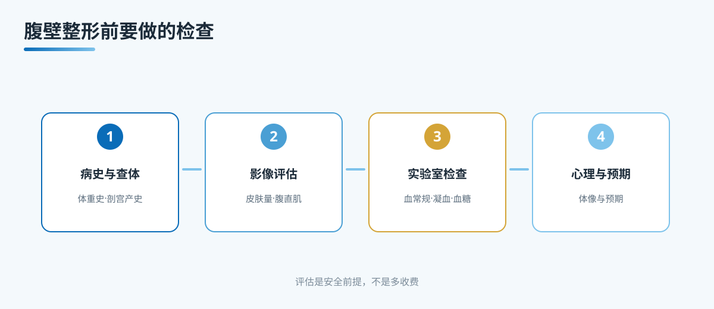

# A5 腹壁整形前要做的检查：先评估，再谈手术

> 本文档为腹壁整形系列 A 档大众科普长稿，格式参照 microtia 站。
> 依据公开权威标准（ASPS 腹壁整形术前评估、ISAPS、国内整形外科教材），发布前由专科医生审校。

## 三个备选标题

1. 腹壁整形前要做的检查：先评估，再谈手术
2. 想做腹壁整形，先把这几项检查做全再说
3. 肚子松想做手术？术前评估不是多收费

本稿选用第 1 个作为工作标题。

## 封面介绍（100 字以内）

腹壁整形不是想做就做。出血风险、愈合能力、腹壁有没有疝、血糖血压稳不稳，都要先评估。术前检查把风险挡在台前，这一步是安全前提，不是多收费用。

## 正文

先说结论：**腹壁整形的第一步不是选切口，而是做评估。**这是一项去除多余皮肤与脂肪、同时收紧腹直肌的手术，涉及较长切口、较大范围的组织剥离和较长的恢复期。它的风险点主要不在手术本身，而在于术前有没有把出血倾向、愈合不良、腹壁结构异常和全身疾病查清楚。把这一步做扎实，才是安全的最大前提。

很多患者问"能不能快点约手术"。理解这个心情，但我要先把一件事讲明白：评估做全套，不等于检查越贵越好，更不等于多收费。它是在回答"你的身体适不适合做、用哪种方案风险最小"，而不是在推销项目。

### 先分诊：哪些人要先做评估，甚至先不急着做手术

在谈检查细节之前，先做一次分诊。下面这些情况，评估的优先级和目的不一样：

- 身体基本健康、没有慢病的人。重点是常规实验室检查和腹壁结构筛查。
- 有高血压、糖尿病、凝血问题、长期服药的人。评估的核心是内科与用药能否耐受手术，可能需要先调整、再评估。
- 刚生育、还在哺乳或还有生育计划的人。肩腹壁组织的状态会随妊娠变化，评估会讨论时机，而不是急着定手术。
- 近期体重波动大、或正在备孕的人。先稳定体重、明确生育计划，再谈手术，效果更稳。
- 腹部摸到可疑肿块、脐部或腹壁有膨出的人。先排除腹壁疝与腹部疾病，再谈外观。
- 吸烟者。吸烟直接影响血供与伤口愈合，评估里会正式讨论戒烟（详见 A7）。

分诊这一步不花功夫，却能避开"明明不适合，却先约了手术"的弯路。

### 病史采集：医生会先问的几件事

术前评估从问病史开始，这部分可以提前梳理好，能省很多时间。

- 体重史。曾经最高体重、最低体重、是否做过减重手术、过去一年体重波动多大。明显波动对手术时机和皮肤量判断有影响。
- 妊娠史。生育次数、是否剖宫产、腹直肌分离情况、是否还打算再生育。再妊娠可能让腹壁重新松弛，评估要讨论时机。
- 腹部手术史。剖宫产、胆囊手术、腹部肿瘤或疝修补手术等。既往切口与瘢痕会影响皮肤血供和术式选择，是评估的重点。
- 高血压、糖尿病、凝血问题。有病史者需要确认控制情况，必要时先看内科。血糖控制不佳会显著增加伤口愈合不良与感染风险。
- 抗凝与用药史。长期服用阿司匹林、华法林、新型口服抗凝药、某些中草药与补剂的人，要在术前按医嘱调整（详见 A7）。
- 过敏史与吸烟史。药物、麻醉、皮肤敷料过敏，以及是否吸烟、一天几支，都要说清楚。
- 停药与术后恢复的顾虑。身体活动、弯腰、抱孩子这些日常动作，在恢复期要做到什么程度，医生要有数。

病史问得越细，方案就越有依据。

### 专科查体：摸一摸、捏一捏，判断"松"在哪一层

查体是术前评估里最核心的一步，主要是用手和肉眼判断腹壁各层的情况。

- 皮肤量与皮肤弹性。捏起腹部皮肤，判断松弛程度、皮肤厚度与弹回情况。这决定了要不要切除、切除多少。
- 脂肪厚度。用拇指和食指捏起皮下脂肪，评估厚度与分布。脂肪过多可能需要联合吸脂。
- 腹直肌分离。平躺做抬头或卷腹动作，医生用手指判断腹直肌间隙有多宽、有多松。这是决定要不要术中收紧的重要依据。
- 腹壁疝筛查。站立用力咳嗽或屏气时，观察脐部、腹直肌缘、腹部中线有没有膨出或疝。腹壁疝要先处理，不能直接当成"松"。
- 脐部与既往瘢痕。肚脐的位置、大小、有无脐疝或脐凹，既往切口的位置与张力，都会影响切口设计与脐移位方案。
- 站立与平躺对比。站立下垂、平躺回缩的程度，帮助区分皮肤因素与脂肪因素。

查体是医生用手判断的，这比只看照片更能反映真实情况。所以术前评估一定要到院，线上效果图给不出这一步。

### 影像检查：超声是标配，其他按需

影像的意义是把"摸到的"和"看不到的"都确认一下。

- 腹部彩色多普勒超声。这是腹壁成形前常用的一项，用来明确腹壁分层、排除腹壁疝、查看腹直肌分离程度和皮下脂肪厚度。它便宜、无辐射，是很多中心的常规。
- MRI 或 CT。当超声提示复杂解剖、怀疑腹壁占位、或需要更精确评估皮肤与肌肉层时，医生会按需安排，不是人人都要做。属于"必要才做"。
- 一般不推荐把影像查得越多越好。检查的项目由医生根据查体与病史决定，不是越多越安全。

### 实验室检查：血、凝血、血糖、肝肾

这部分直接关系到出血与愈合风险，是安全评估的关键。

- 血常规。看血红蛋白、白细胞、血小板基础值，评估贫血与感染风险。
- 凝血功能。看凝血酶原时间、活化部分凝血活酶时间、血小板计数，评估出血倾向。
- 肝肾功能。评估代谢与排泄能力，排除影响手术耐药的肝脏、肾脏问题。
- 血糖。血糖控制情况直接决定伤口愈合质量。
- 传染病筛查（按机构与政策）。梅毒、乙肝、丙肝、艾滋病等，既是为患者安全，也是医院管理规范。
- 心电图与心肺评估。腹壁整形通常需要全身麻醉，麻醉科会综合查体、影像、实验室资料做耐受力评估。

这些检查不是"走过场"。任何一个异常值，都可能让医生改变麻醉方式、调整方案或推迟手术。

### 心理评估：预期要合理，不是"做完美才安心"

腹壁整形不只是身体手术，也对自我期待有影响。术前会谈会一起讨论：

- 你期待的改善是什么，是轮廓更紧致，还是解决烦人的松弛与褶痕。
- 术后瘢痕、恢复期、可能的二次调整，你愿意接受吗。
- 有没有难以缓解的身材焦虑，或对"做一次就完美"的过高期待。
- 身体在意程度是否已经影响到平时生活与心情。

心理评估不是为了劝退，而是让预期和现实对齐。预期越合理，术后满意度往往越高。

### 边界与不承诺

- 不承诺"无痕、零风险、一次永久、腹部完全平整"。
- 不承诺"术后不再变化"。体重波动、妊娠、年龄都会影响长期形态。
- 不承诺"检查通过就保证手术顺利"。检查是降低风险，不是消除风险。
- 不把"腹壁整形=身材管理"当卖点。这项手术解决的是腹壁松弛与结构问题，不代表身材管理或减重替代。

### 就诊清单与可问医生的问题

到重庆西区医院医学美容中心就诊前，可以带上：

- 既往分娩与腹部手术的出院小结，尤其剖宫产、疝手术。
- 近一年体重变化记录。
- 正在服的药物清单，含保健品与中草药。
- 慢病如糖尿病、高血压的近期复查记录。

当面可以问医生：

- 我的主要矛盾是皮肤、脂肪还是腹直肌分离，判断依据是什么。
- 需要做哪些检查，每一项是为了排除什么风险。
- 腹壁有没有疝，需不需要先处理。
- 我的血糖、凝血、用药情况需不需要先调整或看内科。
- 麻醉评估怎么做，全麻风险如何。
- 本机构是否具备腹壁成形、麻醉评估、术后随访与并发症处理的完整能力。

## 收尾

腹壁整形的安全，从术前评估开始。病史、查体、影像、实验室、心理，这五个环节不是额外付费的"附加项"，而是把出血、愈合不良、腹壁疝和内科风险挡在手术之前的关键。把评估做扎实，再谈方案与时机，比着急约手术更负责任。

> 本文用于健康教育，不能替代整形外科/普外专科查体与麻醉评估。

## 参考资料

- American Society of Plastic Surgeons. Tummy Tuck (Abdominoplasty) - Safety & Preparation. https://www.plasticsurgery.org/cosmetic-procedures/tummy-tuck
- International Society of Aesthetic Plastic Surgery (ISAPS). Abdominoplasty. https://www.isaps.org/
- 中华医学会整形外科分会. 腹壁整形诊疗共识（公开版检索）

## 版本说明

- 大纲依据：《腹壁整形系列大纲.md》
- 本稿版本：v1（待专科医生审校）
- 待办：医生署名、专科审校、机构能力边界自检
